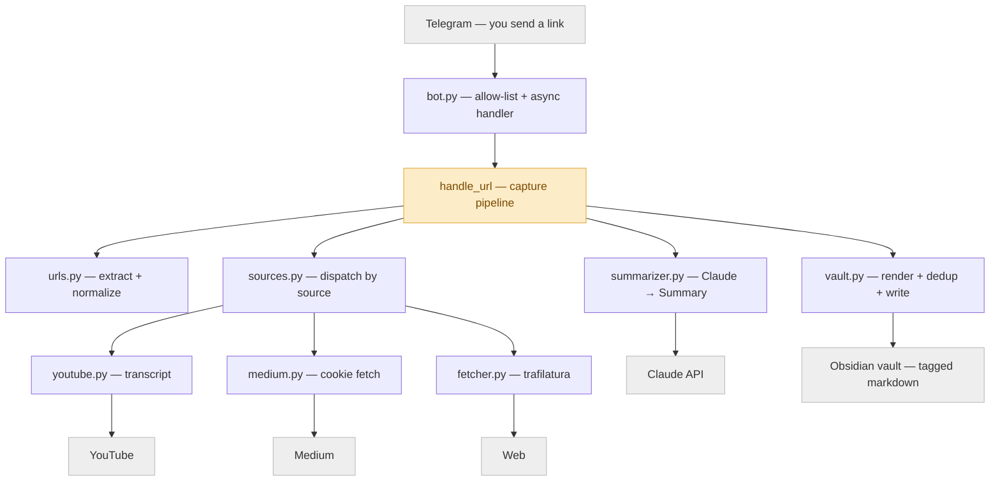
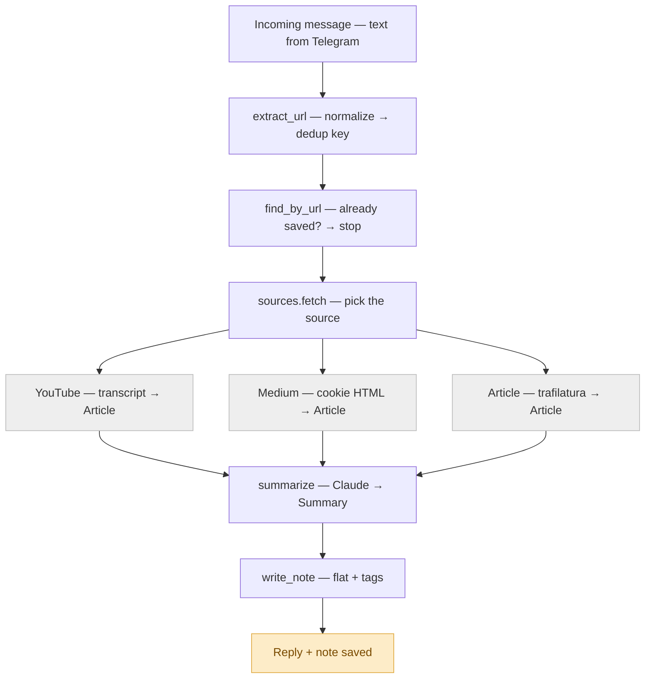

# Second Brain Telegram Bot

Send a link to your Telegram bot → it fetches the article (or a **YouTube
video's transcript**), writes a **technical summary** with Claude, replies to you
in the chat, and files a Markdown note into a dedicated **Obsidian** vault
(a flat, tag-organized reference library). Review and remix your reading later in
Obsidian.

```
Telegram message → extract URL → fetch article → summarize (Claude)
                → save tagged note → reply with the summary
```

Single-user by design (only your Telegram id is served). Runs locally; built
config-driven so moving it to a server later is mechanical.

## Requirements

- Python 3.13 + [uv](https://docs.astral.sh/uv/)
- A Telegram bot token
- An Anthropic API key (Claude)

## Setup

```bash
uv sync                 # install dependencies
cp env.example .env     # then edit .env (see below)
```

Fill in `.env`:

| Variable | How to get it |
|---|---|
| `TELEGRAM_BOT_TOKEN` | Message [@BotFather](https://t.me/BotFather), `/newbot`, copy the token |
| `TELEGRAM_ALLOWED_USER_ID` | Message [@userinfobot](https://t.me/userinfobot); it replies with your numeric id. Only this user is served. |
| `ANTHROPIC_API_KEY` | From the [Anthropic Console](https://console.anthropic.com/) |
| `ANTHROPIC_MODEL` | Claude model for summaries. Defaults to `claude-sonnet-4-6`. |
| `VAULT_PATH` | Path to the Obsidian vault the bot owns (e.g. `./vault`). Notes are written flat here on startup. |
| `MEDIUM_COOKIE` | *(optional)* Your Medium `sid` cookie, so member-only articles you pay for are summarized in full. Empty = free/teaser content only. See "Medium" below. |

## Run

```bash
uv run python -m second_brain.main
```

Then, from the Telegram account whose id you configured, send the bot a link.
You'll get a summary reply, and a note will appear under
`<VAULT_PATH>/` (open the vault in Obsidian to browse).

- Re-sending the same link → "already in your second brain", no duplicate note.
- Sending a non-link message → a short usage hint, no note.
- **YouTube links** are summarized from the video's transcript. If a video has no
  usable transcript (captions disabled/unavailable), the bot says so and saves
  nothing.
- **Medium links** work out of the box for free posts. For **member-only**
  articles, set `MEDIUM_COOKIE` (see below) so the bot fetches the full text you
  pay for; without it, member-only links only yield the public teaser.

### Medium member-only articles

Set `MEDIUM_COOKIE` to the value of your `sid` cookie on `medium.com`
(browser DevTools → Application → Cookies → `medium.com` → `sid`). The bot then
downloads member-only articles as the logged-in you and summarizes the full text.
Treat it like a password: it's read from `.env` (gitignored) and only sent to
Medium. The session expires periodically — when member-only notes start coming
back as teasers, paste a fresh cookie. Only `medium.com` / `*.medium.com` URLs are
recognized; Medium publications on custom domains fall back to the normal fetch.

## Notes & tags

Notes are Markdown with YAML frontmatter, written **flat** at the vault root and
organized by **tags** — 2–5 topic tags from the summary plus a `source` tag
(`article` / `youtube` / `medium`), so you can filter by topic or where it came
from. Example:

```markdown
---
title: "Building Agentic Systems"
source: "https://example.com/post"
date: 2026-06-30
tags: [agentic-dev, llm, article]
---
## TL;DR
...
## Key technical points
- ...
## Prototype ideas
- ...
```

## Tests

```bash
uv run python -m unittest discover -s tests
```

The full suite runs without a Telegram token or API key — the network, the LLM,
and Telegram are mocked. Only the live run above needs real credentials.

## Architecture

Every fetcher returns the same `Article`, so the pipeline is source-agnostic —
adding a source is a new module plus one line in `sources.py`.



Data flow for one message — the branch (YouTube / Medium / Article) re-converges
because each produces an `Article`. Any failure short-circuits to a clear reply,
and the note write is always last (so no partial notes):



> Diagram sources live in `.diagrams/` as Mermaid (`.mmd`) — the same content as
> the blocks above, ready to paste into an Obsidian note.

## Roadmap

- **Phase 2 — Ask your second brain:** query your saved notes from the same
  Telegram bot ("what have I saved about agent memory?") via search/RAG over the
  vault. Designed toward, not built yet.
- **Cloud:** the bot is env-driven and docker-aware, so hosting it on a server
  (always-on) is a later, mechanical step.

## Project layout

- `second_brain/config.py` — settings from environment
- `second_brain/urls.py` — extract + normalize URLs (dedup key)
- `second_brain/fetcher.py` — article extraction (trafilatura)
- `second_brain/youtube.py` — YouTube detection + transcript fetch
- `second_brain/medium.py` — Medium detection + cookie-authenticated fetch
- `second_brain/sources.py` — routes a URL to the article / YouTube / Medium fetcher
- `second_brain/summarizer.py` — Claude summary → structured `Summary`
- `second_brain/vault.py` — note rendering, flat write + dedup
- `second_brain/bot.py` — capture pipeline + Telegram wiring
- `second_brain/main.py` — entry point (long-polling)
- `specs/` — the spec, plan, and task breakdown (spec-driven development)
