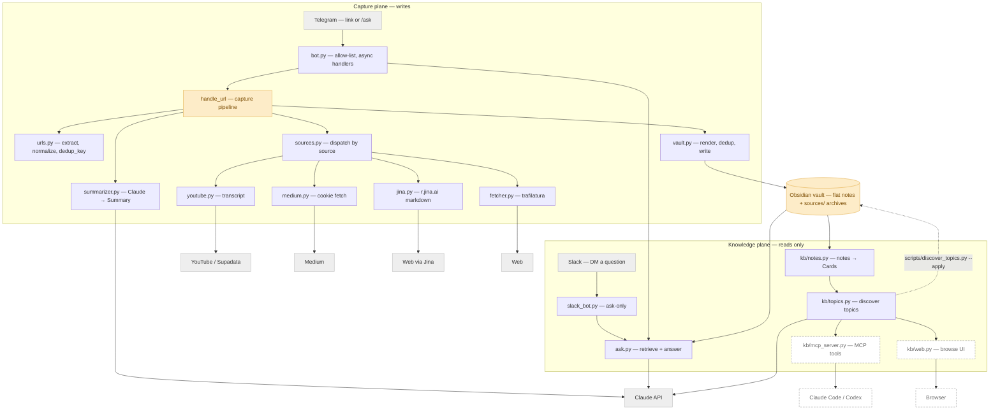
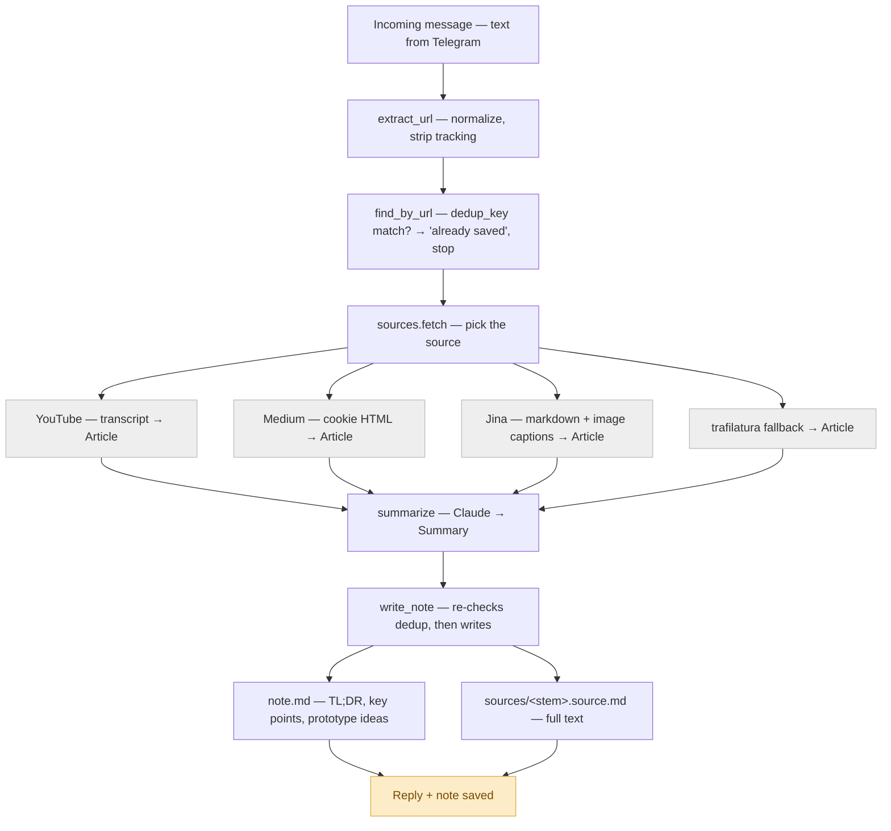

# Second Brain Telegram Bot

Send a link to your Telegram bot → it fetches the article (or a **YouTube
video's transcript**), writes a **technical summary** with Claude, replies to you
in the chat, and files a Markdown note into a dedicated **Obsidian** vault
(a flat, tag-organized reference library). Review and remix your reading later in
Obsidian.

```
Telegram message → extract URL → fetch article → summarize (Claude)
                → save tagged note → reply with the summary
```

Single-user by design (only your Telegram id is served). Runs locally; built
config-driven so moving it to a server later is mechanical.

## Requirements

- Python 3.13 + [uv](https://docs.astral.sh/uv/)
- A Telegram bot token
- An Anthropic API key (Claude)

## Setup

```bash
uv sync                 # install dependencies
cp env.example .env     # then edit .env (see below)
```

Fill in `.env`:

| Variable | How to get it |
|---|---|
| `TELEGRAM_BOT_TOKEN` | Message [@BotFather](https://t.me/BotFather), `/newbot`, copy the token |
| `TELEGRAM_ALLOWED_USER_ID` | Message [@userinfobot](https://t.me/userinfobot); it replies with your numeric id. Only this user is served. |
| `ANTHROPIC_API_KEY` | From the [Anthropic Console](https://console.anthropic.com/) |
| `ANTHROPIC_MODEL` | Claude model for summaries. Defaults to `claude-sonnet-4-6`. |
| `VAULT_PATH` | Path to the Obsidian vault the bot owns (e.g. `./vault`). Notes are written flat here on startup. |
| `MEDIUM_COOKIE` | *(optional)* Your Medium `sid` cookie, so member-only articles you pay for are summarized in full. Empty = free/teaser content only. See "Medium" below. |
| `JINA_API_KEY` | *(optional)* [Jina Reader](https://jina.ai/reader) key. When set, web articles are fetched as Markdown **with image captions** (diagrams get summarized too). Empty → local trafilatura, text only. |
| `JINA_ENABLED` | `true`/`false` (default `true`). Set `false` to always use trafilatura and never call Jina. |

## Run

```bash
uv run python -m second_brain.main
```

Then, from the Telegram account whose id you configured, send the bot a link.
You'll get a summary reply, and a note will appear under
`<VAULT_PATH>/` (open the vault in Obsidian to browse).

- While it works (fetching, summarizing, or answering), the bot shows Telegram's
  **"typing…"** indicator so you know your message was received.
- Re-sending the same link → "already in your second brain", no duplicate note.
- **Ask your notes:** `/ask what have I saved about agent memory?` → the bot
  searches your saved notes and answers with Claude, citing the notes it used
  (see "Ask your second brain" below).
- Sending a non-link message → a short usage hint, no note.
- **Web articles**: with `JINA_API_KEY` set, pages are fetched via Jina Reader as
  Markdown **with vision-model image captions**, so diagrams/screenshots are
  summarized too. Without a key it falls back to local trafilatura (text only).
- **YouTube links** are summarized from the video's transcript. By default it uses
  the local `youtube-transcript-api`; set `SUPADATA_API_KEY` to fetch via
  [Supadata](https://supadata.ai) instead, whose servers avoid the YouTube IP block
  that hits the local library from cloud/VPS hosts (and can even AI-generate a
  transcript for caption-less videos). If no transcript can be produced, the bot
  says so and saves nothing.
- **Medium links** work out of the box for free posts. For **member-only**
  articles, set `MEDIUM_COOKIE` (see below) so the bot fetches the full text you
  pay for; without it, member-only links only yield the public teaser.

### Medium member-only articles

Set `MEDIUM_COOKIE` to the value of your `sid` cookie on `medium.com`
(browser DevTools → Application → Cookies → `medium.com` → `sid`). The bot then
downloads member-only articles as the logged-in you and summarizes the full text.
Treat it like a password: it's read from `.env` (gitignored) and only sent to
Medium. The session expires periodically — when member-only notes start coming
back as teasers, paste a fresh cookie. Only `medium.com` / `*.medium.com` URLs are
recognized; Medium publications on custom domains fall back to the normal fetch.

## Notes & tags

Notes are Markdown with YAML frontmatter, written **flat** at the vault root and
organized by **tags** — 2–5 topic tags from the summary plus a `source` tag
(`article` / `youtube` / `medium`), so you can filter by topic or where it came
from.

**Every** capture also preserves the full canonical Markdown of the source as a
companion `sources/<note>.source.md`, linked both ways from the note — so nothing
is lost, you can re-summarize later without re-fetching, and `/ask` can draw on the
full content (see `specs/design-canonical-archive.md`). The `.source.md` marker
makes archives findable by extension regardless of folder. Example note:

```markdown
---
title: "Building Agentic Systems"
source: "https://example.com/post"
date: 2026-06-30
tags: [agentic-dev, llm, youtube]
archive: "[[sources/2026-06-30-building-agentic-systems.source]]"
---
## TL;DR
...
## Key technical points
- ...
## Prototype ideas
- ...
```

## Tests

```bash
uv run python -m unittest discover -s tests
```

The full suite runs without a Telegram token or API key — the network, the LLM,
and Telegram are mocked. Only the live run above needs real credentials.

## Ask your second brain

Query what you've saved, right from Telegram:

```
/ask what have I saved about agent memory?
```

The bot does a keyword search over your notes (title, tags, body), feeds the best
matches to Claude, and replies with an answer that **cites the notes it used**. If
nothing matches, it says so rather than guessing. Retrieval is intentionally simple
(lexical) for now and lives behind one `ask()` entry point, so it can be upgraded to
semantic search later without touching the command.

## Slack (optional) — ask at your desk

Two channels for two modes: **Telegram for capture** (throw links at it on the go)
and **Slack for querying** what you've saved (at your computer). The Slack bot
answers questions from your notes with the same `ask` brain — DM it a question and
it replies. Paste a *link* in Slack and it nudges you to use Telegram (capture's
home). Both channels share one vault, so anything you saved on the go is queryable
at your desk.

**Set up the Slack app** (one-time; a personal workspace is fine):

1. Create an app at [api.slack.com/apps](https://api.slack.com/apps) → *From scratch*, pick your workspace.
2. **Socket Mode** → enable → creates an **App-Level Token** (`xapp-…`, scope `connections:write`) → `SLACK_APP_TOKEN`.
3. **OAuth & Permissions** → Bot Token Scopes: `chat:write`, `reactions:write`, `im:history`. Install to workspace → **Bot User OAuth Token** (`xoxb-…`) → `SLACK_BOT_TOKEN`.
4. **Event Subscriptions** → enable, subscribe to bot event **`message.im`** (no request URL needed with Socket Mode).
5. Your Slack **member ID** (profile → *Copy member ID*, `U…`) → `SLACK_ALLOWED_USER_ID`.

**Run it** (its own process, alongside the Telegram bot):

```bash
uv run python -m second_brain.slack_main
```

Then DM the bot (under *Apps* in Slack) a question like *"what have I saved about
agent memory?"*.

## Architecture

Two planes that meet at the vault. The **capture plane** writes: Telegram in, a
Markdown note out. The **knowledge plane** only reads what capture produced.
Nothing is pushed between them — the vault on disk *is* the interface, so capture
can never be broken by a reader being down.

Every fetcher returns the same `Article`, so the pipeline is source-agnostic —
adding a source is a new module plus one line in `sources.py`.

Dashed nodes are designed but not built (see `specs/design-knowledge-base.md`).


```mermaid
flowchart TD
    subgraph capture["Capture plane — writes"]
        tg["Telegram — link or /ask"] --> bot["bot.py — allow-list, async handlers"]
        bot --> handle["handle_url — capture pipeline"]
        handle --> urls["urls.py — extract, normalize, dedup_key"]
        handle --> sources["sources.py — dispatch by source"]
        handle --> summarizer["summarizer.py — Claude → Summary"]
        handle --> vault["vault.py — render, dedup, write"]
        sources --> youtube["youtube.py — transcript"]
        sources --> medium["medium.py — cookie fetch"]
        sources --> jina["jina.py — r.jina.ai markdown"]
        sources --> fetcher["fetcher.py — trafilatura"]
    end

    subgraph knowledge["Knowledge plane — reads only"]
        slack["Slack — DM a question"] --> slackbot["slack_bot.py — ask-only"]
        slackbot --> ask["ask.py — retrieve + answer"]
        kbnotes["kb/notes.py — notes → Cards"] --> kbtopics["kb/topics.py — discover topics"]
        mcp["kb/mcp_server.py — MCP tools"]:::planned
        web["kb/web.py — browse UI"]:::planned
    end

    obsidian[("Obsidian vault — flat notes + sources/ archives")]

    bot --> ask
    vault --> obsidian
    obsidian --> ask
    obsidian --> kbnotes
    kbtopics -.->|"scripts/discover_topics.py --apply"| obsidian
    kbtopics --> mcp
    kbtopics --> web
    mcp --> agents["Claude Code / Codex"]:::planned
    web --> browser["Browser"]:::planned

    summarizer --> claude["Claude API"]
    ask --> claude
    kbtopics --> claude
    youtube --> yt["YouTube / Supadata"]
    medium --> md["Medium"]
    jina --> web2["Web via Jina"]
    fetcher --> web3["Web"]

    classDef focal fill:#fdecc8,stroke:#e0a93f,color:#7a4b00;
    classDef ext fill:#eeeeee,stroke:#bbbbbb,color:#333333;
    classDef planned fill:#ffffff,stroke:#999999,color:#666666,stroke-dasharray: 5 3;
    class handle focal;
    class tg,slack,claude,yt,md,web2,web3 ext;
    class obsidian focal;
```

### Capture: one message end to end

The branch (YouTube / Medium / Jina / article) re-converges because each produces
an `Article`. Any failure short-circuits to a clear reply. Duplicates are caught
twice — cheaply before the fetch and LLM cost, then again at write time so two
concurrent sends can't both land:


```mermaid
flowchart TD
    msg["Incoming message — text from Telegram"] --> extract["extract_url — normalize, strip tracking"]
    extract --> dedup["find_by_url — dedup_key match? → 'already saved', stop"]
    dedup --> dispatch["sources.fetch — pick the source"]
    dispatch --> yt["YouTube — transcript → Article"]
    dispatch --> md["Medium — cookie HTML → Article"]
    dispatch --> jina["Jina — markdown + image captions → Article"]
    dispatch --> art["trafilatura fallback → Article"]
    yt --> sum["summarize — Claude → Summary"]
    md --> sum
    jina --> sum
    art --> sum
    sum --> write["write_note — re-checks dedup, then writes"]
    write --> note["note.md — TL;DR, key points, prototype ideas"]
    write --> archive["sources/&lt;stem&gt;.source.md — full text"]
    note --> done["Reply + note saved"]
    archive --> done

    classDef focal fill:#fdecc8,stroke:#e0a93f,color:#7a4b00;
    classDef ext fill:#eeeeee,stroke:#bbbbbb,color:#333333;
    class done focal;
    class yt,md,jina,art ext;
```

### Knowledge: from notes to a browsable library

Free-form tags fragment badly (224 distinct tags over 75 notes, 167 used exactly
once), so topics are **derived** rather than taken from tags. The whole corpus of
cards is ~12k tokens, which is why one Claude call replaces embeddings and a
clustering library at this size.

Everything downstream trades on the same idea: send **cards** (title + TL;DR,
~100 tokens), fetch a full note or its archive only once a card proves relevant.
Ten cards is ~1k tokens where ten archives would be ~47k.


```mermaid
flowchart LR
    obsidian[("Obsidian vault<br/>flat notes + sources/ archives")] --> load["ask.load_notes — frontmatter + body"]
    load --> cards["kb/notes.py — Card<br/>title + TL;DR ≈ 100 tokens"]
    cards --> discover["kb/topics.py — one Claude call<br/>over every card (~12k tokens)"]
    discover --> taxonomy[["kb/topics.json — stable ids"]]
    taxonomy -.->|"--apply"| frontmatter["topics: in note frontmatter"]
    frontmatter --> obsidian

    taxonomy --> retrieval["kb/retrieval.py — topic filter<br/>then semantic rank"]:::planned
    cards --> retrieval
    retrieval --> mcp["MCP tools<br/>list_topics · search_notes<br/>get_note · get_source · ask"]:::planned
    retrieval --> web["Browse UI<br/>topics → cards → note"]:::planned
    mcp --> tunnel{{"Cloudflare Tunnel + Access"}}:::planned
    web --> tunnel
    tunnel --> outside["Claude Code · Codex · browser"]:::planned

    classDef focal fill:#fdecc8,stroke:#e0a93f,color:#7a4b00;
    classDef planned fill:#ffffff,stroke:#999999,color:#666666,stroke-dasharray: 5 3;
    class cards,taxonomy focal;
```

### Processes and storage

| Piece | What it is |
|---|---|
| `main.py` → `rr-second-brain-telegram` | Capture. The only writer. |
| `slack_main.py` → `rr-second-brain-slack` | Ask-only. A link here gets a nudge to use Telegram. |
| Obsidian vault | Source of truth. Flat `*.md` + `sources/*.source.md` archives. |
| `second_brain/kb/topics.json` | The taxonomy, versioned in git so drift is visible. |
| `scripts/*.py` | User-run maintenance (dedupe, flatten, discover topics). Dry-run by default. |

No database. At ~75 notes growing ~35/month, the corpus is ~26k words of notes
and ~233k of archives — it loads into memory in milliseconds.

> Diagram sources live in `.diagrams/` as Mermaid (`.mmd`) — the same content as
> the blocks above, ready to paste into an Obsidian note. The `.png`/`.svg`
> renders alongside them are from July and are now stale.

## Roadmap

- **Ask your second brain — done (lexical):** `/ask` searches notes by keyword and
  answers with Claude. Next: upgrade retrieval to semantic search if keyword
  matching starts missing things.
- **Resurfacing:** a weekly digest or `/spark` command to resurface saved notes so
  the library doesn't go stale.
- **Cloud:** the bot is env-driven, so hosting it on an always-on server is a later,
  mechanical step.

## Project layout

- `second_brain/config.py` — settings from environment
- `second_brain/urls.py` — extract + normalize URLs (dedup key)
- `second_brain/fetcher.py` — article extraction (trafilatura)
- `second_brain/youtube.py` — YouTube detection + transcript fetch
- `second_brain/medium.py` — Medium detection + cookie-authenticated fetch
- `second_brain/sources.py` — routes a URL to the article / YouTube / Medium fetcher
- `second_brain/summarizer.py` — Claude summary → structured `Summary`
- `second_brain/vault.py` — note rendering, flat write + dedup
- `second_brain/ask.py` — retrieval + Claude answer for `/ask`
- `second_brain/bot.py` — capture pipeline + Telegram wiring
- `second_brain/slack_bot.py` — Slack adapter (desk-side `ask`)
- `second_brain/main.py` — Telegram entry point (long-polling)
- `second_brain/slack_main.py` — Slack entry point (Socket Mode)
- `specs/` — the spec, plan, and task breakdown (spec-driven development)
